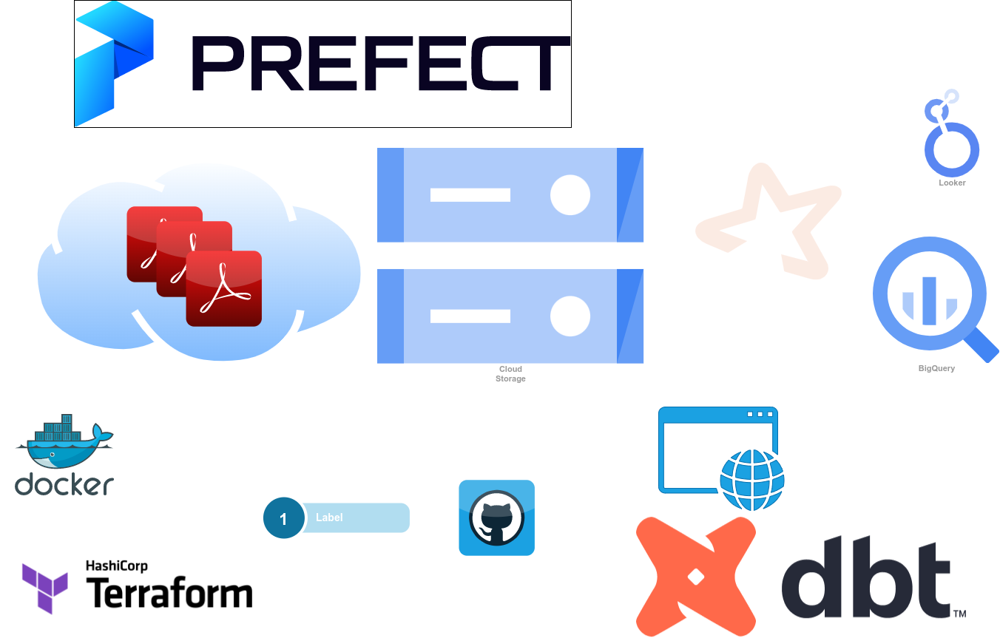

# Gas LP Max Price

## Data Engineering Zoomcamp - Capstone Project

## Overview

A partir de Agosto del 2021 el gobierno de México empezo a publicar los precios máximos del gas LP con base a una metodología que fue aprobada por la Comisión Reguladora de Energía (CRE).

Cada sábado los precios son publicados para todos los municipios vigentes y son divididos en 145 regiones de precios establecidos por la Secretaría de Economía. Los permisionarios deben respetar los precios publicados por el regulador.

Todo esto debido al gran incremento de los precios que impactan los niveles de inflación.

El objetivo de este proyecto es:

- Mostrar los precios máximos de gas LP para que puedan ser consultados y validados contra los de los permisionarios y exigir que se respeten si fuera el caso.
- ¿Cuáles son las regiones con mayores y menores incrementos?
- ¿Cuál es el precio promedio por región?
- ¿Cuál es el precio promedio por municipio?
- ¿Cuál es la entidad federativa con el precio más alto de gas LP?
- ¿Cuál es la entidad federativa con el precio más bajo de gas LP?

## Architecture

El siguiente diagrama muestra la arquitectura y data pipeline del proyecto.

## Technology

- Infrastructure as code (IaC): Terraform
- Workflow orchestration: Prefect
- Containerization: Docker
- Data Lake: Google Cloud Storage (GCS)
- Data Warehouse: BigQuery
- Transformations: dbt
- Visualization: Google Looker Studio

## Dataset

Los datos fueron obtenidos de las tabla de precios máximos aplicables de Gas LP a consumidores finales por región y medio de venta publicados en la siguiente página [https://www.gob.mx/cre/documentos/precios-maximos-aplicables-de-gas-lp](https://www.gob.mx/cre/documentos/precios-maximos-aplicables-de-gas-lp)

TODO: agregar data dictionary

## Data Pipeline

### Orchestation

La orquestacón sera realizada con [Prefect](https://www.prefect.io/), el procesamiento será en **batch** y se ejecutara cada semana con un flujo calendarizado.

### Ingest

Las tablas con los datos se encuentran en documentos PDF en la página web mencionada arriba y serán obtenidos utilizando la librería [gazpacho](https://github.com/maxhumber/gazpacho) para web scrapping, posteriormente se extraera la información y pasára a formato CSV utilizando la librería [tabula-py](https://pypi.org/project/tabula-py/) para finalmente generar [Parquet files](https://parquet.apache.org/) utilizando [Pandas](https://pandas.pydata.org/).

### Storage

Los archivos CVS y Parquet son almacenadas en un Data Lake en Google Cloud Storage (GCS).

